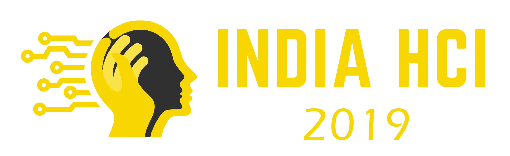

This workshop at [India HCI 2019](https://www.indiahci.org/2019/) invites participants those who have done Ph.D. in HCI in the past, those who are doing it currently, and those who would like to start doing it in the near future. The main goal of this workshop is to bring together Indian HCI Ph.D. students to meet and discuss ideas. Currently, with the exception of INTERACT 2017 doctoral consortium, there are less avenues for HCI students to meet, discuss and get feedback on their work.

The key purpose is to have an informal and interactive discussion about each candidates’ ongoing research, with the intention to sharpen it. We are looking for a diverse group of people who are interested in presenting their work/research at the workshop during the conference. This workshop aims to provide useful guidance for completion of the research and the initiation of a research career in a friendly and constructive atmosphere.

The workshop has the following objectives:
- The workshop shall provide a joint forum for participants coming from different, mostly disconnected research backgrounds.
- The participants shall learn about the latest developments in their own as well as adjacent HCI research areas.
- The workshop shall foster interaction among the participants and establish collaborations between the researchers for future research work.
- After the workshop, provide a set of publicly available key readings for thinking about discussed questions and a set of position papers, updated based on the workshop, that explains participants’ thinking about these questions.

    

India HCI '19 will take place from November 1 - 3 (Fri - Sun), 2019 in Hyderabad, India.

  

# Organisers
- [Amit Jena](https://amitjenaiitbm.github.io/amitjena/) (IITB-Monash Research Academy - Mumbai, India)
  - Email: amit.jena@monash.edu & Mobile: +91-7540873626
- [Shimmila Bhowmick](http://embeddedinteractions.com/people.html) (Indian Institute of Technology – Guwahati, India)
  - Email: shimmila.bhowmick@gmail.com & Mobile: +91-8404075322

# Call for applications

*Our call for applications is now [closed](call.md)!*

# Participants

Vidya Sarangapani (Open Lab, England)  
Pranjal Protim Borah (EI LAB, IIT Guwahati, India)  
Asad Ali Junaid (Adobe Inc., Bengaluru, India)  
Nagraj Emmadi (Wipro Limited, Hyderabad, India)  
Chandni Murmu (Gramener, Hyderabad, India)  
Ankita Diwan (Shipsy, Gurgaon, India)  
Nikhil Prakash (R.V. College of Engineering, Bangalore, India)  
Nishita Nirmal (IDC School of Design, IIT Bombay, Mumbai, India)  

# Program

Tentative program:

<table>
<tr>
	<th colspan="2">Friday November 1</th>
</tr>
<tr>
	<td width="50">11:00</td><td width="500">Intro & overview</td>
</tr>
<tr>
	<td>11:15</td><td>Icebreaker</td>
</tr>
<tr>
	<td>11:30</td><td>Panel Discussion</td>
</tr>
<tr>
	<td>12:30</td><td>Lunch</td>
</tr>
<tr>
	<td>13:30</td><td>Participant Presentations</td>
</tr>
<tr>
	<td>15:30</td><td>Breakout sessions</td>
</tr>
</table>
